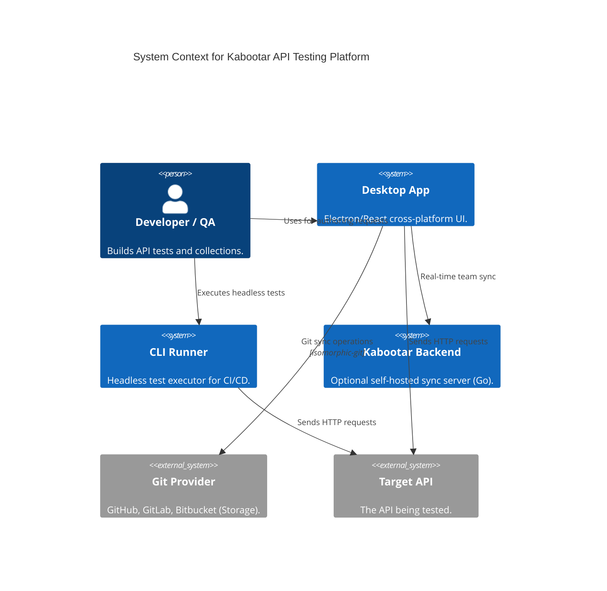
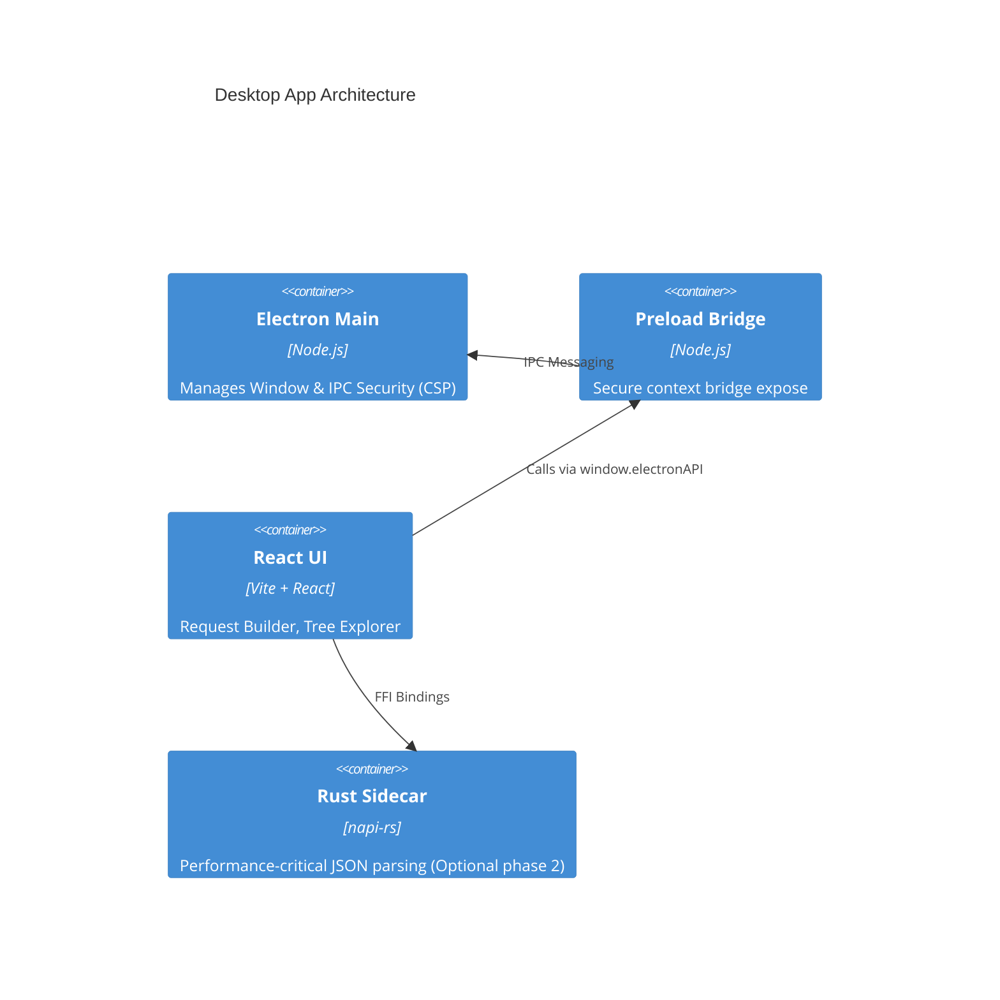

# Architecture

Kabootar is built as a highly modular pnpm monorepo. The core logic is decoupled from the UI, allowing it to run in the Desktop App (Electron) or headless in CI (CLI).

## System Context

## Packages

- `@kabootar/core`: The pure TypeScript request executor, variable interpolator, and collection schema mapper.
- `@kabootar/test-runner`: V8 VM sandbox for writing tests with Chai-like syntax (`kb.expect(kb.response.status).toBe(200)`).
- `@kabootar/git-sync`: Isomorphic Git bindings and filesystem serializers to map collections to `.json` request trees.

## Desktop Container

